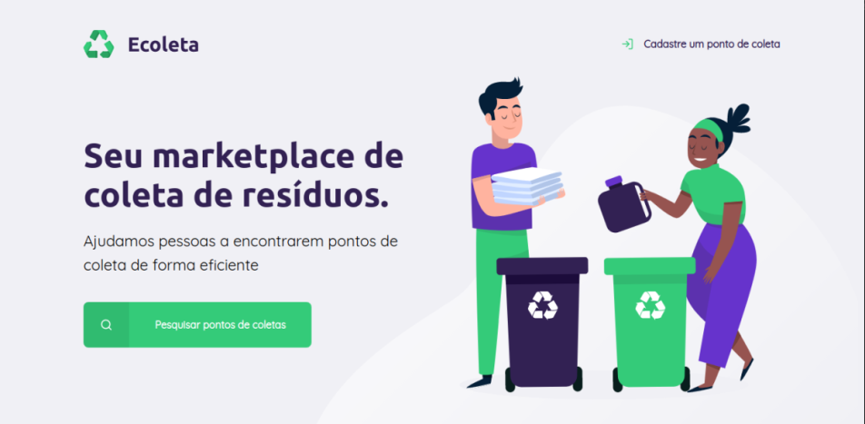

## Next Level Week
O NLW é uma semana prática com muito código, desafios, networking e um único objetivo: te levar para o próximo nível.

### 🏠 [Homepage]
    

## Author

👤 **Bruno Duarte**

* Github: [@bduaart](https://github.com/bduaart)

## Show your support

Give a ⭐️ if this project helped you!

## License

  

***
_This README was generated with ❤️ by [readme-md-generator](https://github.com/kefranabg/readme-md-generator)_
